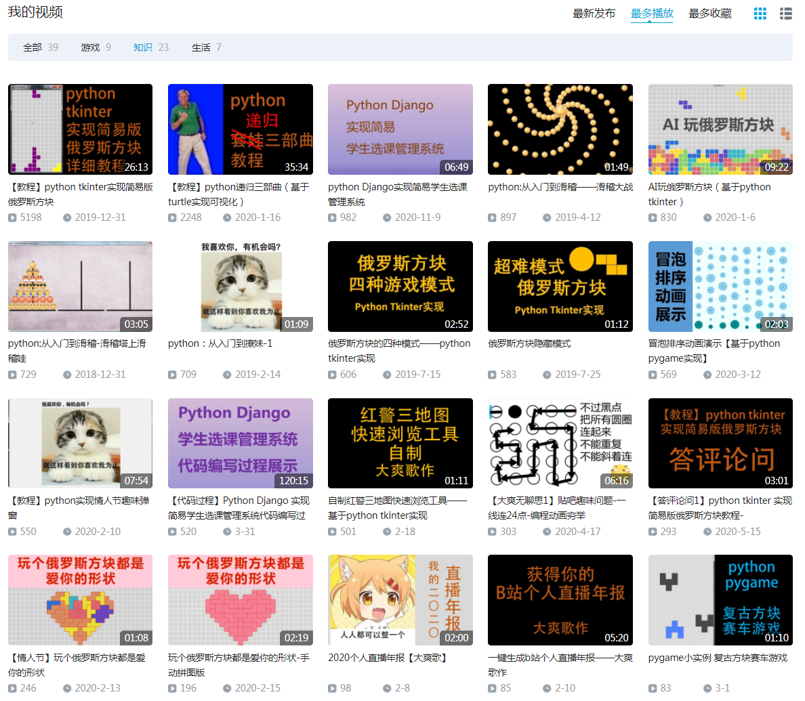
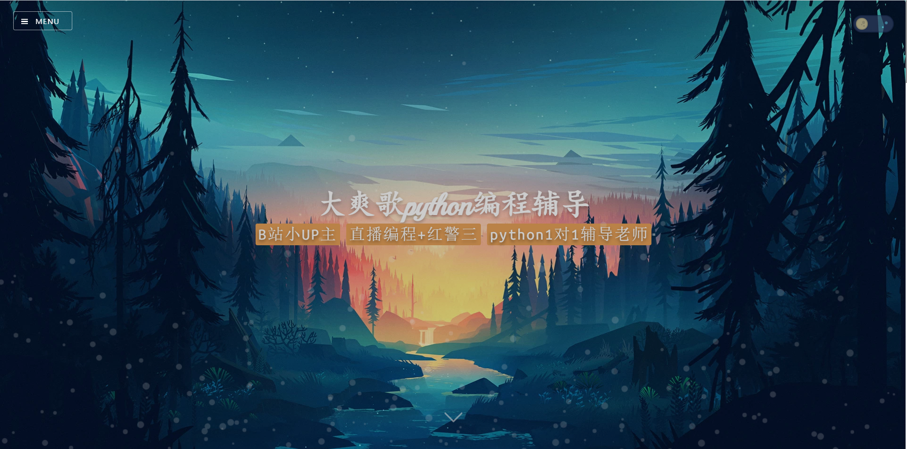
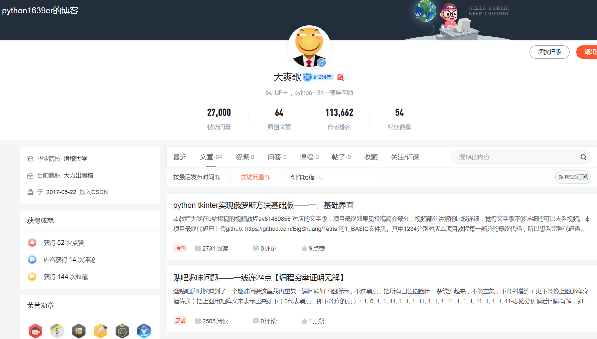
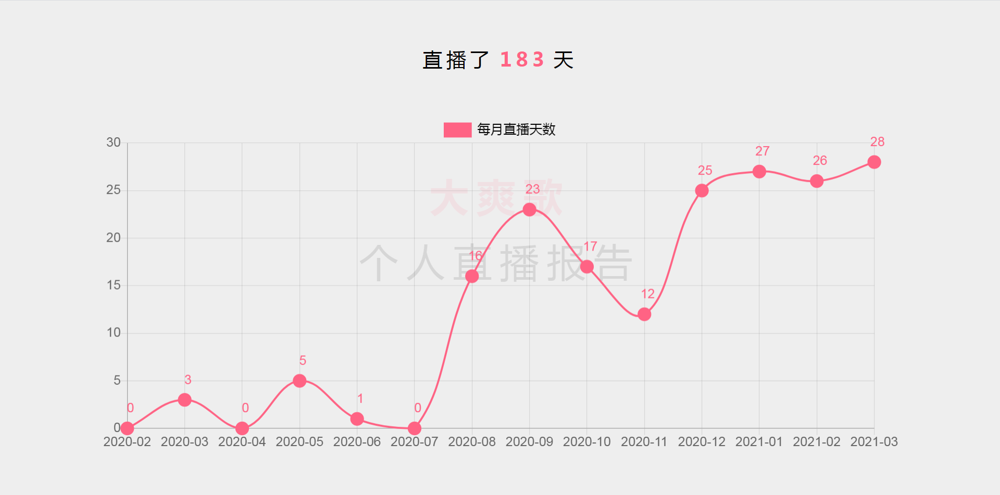

## 标题：我在b站直播编程

## 封面：
直播编程书教程
简单问题免费答

我是大爽，我为自己代言

## 正文
大家好，我是大爽，是python辅导老师

本人直接一对一辅导
没有中间商赚差价
学生少花钱，享受更高质量课程

之前在b站投稿过一些编程项目、编程教程的稿件

这些搞件对应的代码基本都上传到我的github了

其中部分还编写了对应的文本教程，发布到了我的博客（博客园、csdn）

自认为是一个认真、真诚的编程创作者。

同时我还是一个bilibili主播，
时常在b站直播编程(python)和游戏(ra3)

本期视频我想介绍一下我的编程直播，
同时也宣传一下自己的编程直播。

游戏操作太菜，就不多介绍了Orz

后面内容分为4块
- 一 直播心路历程
- 二 直播间亮点介绍：简单问题免费答
- 三 直播特色：我有特殊的直播模式
- 四 其他补充

## 一 - 直播心路历程
其实我在b站已经直播编程很久了。

根据弹幕姬的日志记录。
从去年(2020)2月到今年(2021)4月，我已经直播了一百八十多天
(编程和游戏直播的总天数)

我去年3月到今年4月的每月直播天数

本图由之前的直播年报项目代码生成。
该天数实际为弹幕姬启动天数（大概可以代表个人直播天数）

这只是有(弹幕姬)数据可考证的时间。

我最早应该是19年的秋天，开始的直播。

那时候我还在上海打工。
住的是一个特别小的地方，只有时快时慢的wifi，
没有网线提供稳定的网络，且不方便置办台式电脑直播。
所以只好去网吧直播，抽周内晚上和周末的时候直播。

网吧没有单人包间，只有3-4人的小包间，就这么个小包间还贼贵，一小时15-20左右吧
所以我只能去普通区直播（就是那种一排五六个电脑的那种公共区域），
普通区好像是一小时8块(我办了卡，有8.8折优惠)。
普通区环境噪声很大，所以当时不开麦，
有弹幕的话只能打字回复，有时候回复的慢了结果人都走了。

在那样一种环境下，让我去直播的原因是什么。
- 1是，刚开始去大城市漂泊，自己一个人，
  完全陌生的环境，又没有认识的朋友，
  感觉格外的孤单，所以渴望与人交流。
- 2是，自己希望去分享自己的创作，希望被人看到、被人欣赏。

感觉那段漂泊的日子里，
直播是少有的让我温暖、给我希望的时光。

（还有一段特别暖心的记忆是，我离开上海前，
有个同事来送行和我谈心，聊了很多聊了很久，
那种感觉像是茫茫风雪中燃起了一团火，现在想起来都还是很感动）

时至今日，我仍然喜欢分享自己的创作，喜欢与人交流。
希望自己也能像一团火，给迷茫中艰难探索的新手带来一点温暖。

## 二 直播间亮点介绍：简单问题免费答

但是一直以来，我直播间互动都挺少，
感觉大部分时候都是单机直播。

对于这个问题，我的解决策略是简单问题免费答。

**直播间弹幕提出的简单问题，在条件允许的情况下，我会免费解答。**

简单的判断标准是：两三分钟内能够解答明白的问题。
条件允许的判断标准为：
- 0 我在（一般我直播一小时会休息十几分钟，休息时会弹幕打字说明，这段时间人可能不在电脑前）
- 1 我会
- 2 直播间内提的问题我有时间来解答(太多问题的话，自然回答不过来)
- 3 考虑到如果问题太多，都回答可能太过耗费时间精力，影响我直播时本来打算要做的事情（具体见三）
  所以我给每天免费回答问题的数量设置一个上限，个人认为20算是个合理的值

对于耗时远超三分钟的问题，大多数时候，我只会有偿回答
（打算付费前请先私信我，确定我会不会）

这里详细说下，
越具体的问题越好回答，比如某样一行代码发生了某种报错。

而宽泛的问题并不容易回答，
比如如何学好编程，学什么语言好，学了之后能做什么？
个人认为这些问题，并不是在直播间几分钟能够详细说明白。
对于这些方向性的问题，未来我会出新的视频系列《编程之思》挑选一些进行思考。

同时也要说下问答礼仪。
虽然是免费的回答，但是如果我的回答解决了问题的话，
提问者能够投喂一些免费的辣条或者小心心，实在不行，发个弹幕说点好听的话都可以呀Orz

同时未来直播间回答问题时，我会开启录制，
然后将回答过程发布到个人的视频系列《直播答问》中。

## 三 直播特色：我有特殊的直播模式
介绍完直播间的亮点，
再介绍下我直播间的特色：新颖的直播模式。

自认为该模式能够让大家进直播间后快速高效轻松地明白我在做什么。
同时中间走了再回来也不会耽误重要的信息，不会影响后续的观看体验。

我的编程直播大概分为以下几个阶段（不断循环）。
- 1 编写小项目，代码会及时更新到我的github

编写完成后会录制视频投稿b站

- 2 合适的话，会编写对应的文本教程（中间过程先发github）发到博客园、csdn
（比如播放量高，或者个人认为有意义）

进一步合适的话（博客阅读量高或者比较经典），也会录制对应的视频教程。

在一阶段，进入直播间后，
可以去看我的github项目代码和描述，快速理解我当下在做什么，做到什么阶段了。

在二阶段，进入直播间后，可以去看视频稿件明白做出了什么
也可以去看我的博客更上我直播间的思路。

在这样一种模式下，直播中间的耽搁或离开并不会彻底打断对直播的内容的理解。
因为中间过程都有了文本进行了记录，甚至文本比直播更精炼，是直播的精华。
而直播则是展示这些文本间我的思考过程。
同时有疑问我直播间也可以及时互动，比如觉得教程中文本描述的不够具体不好理解，
我都会根据大家的反馈来不断的优化自己。

## 四 补充说明
最后说下直播时间
并没有一个特别的固定时间，只能说有空就会直播
其中一般周三、周五、周日晚上会打游戏（时间被别的事占了，后面可能会补上来）

其他时间有空就会直播编程。

同时我打游戏的时候不回答编程问题，
如果是要找我付费辅导的，可以直播间里说明，
那么我会在手头那局打完后下播，然后去有偿解答。
