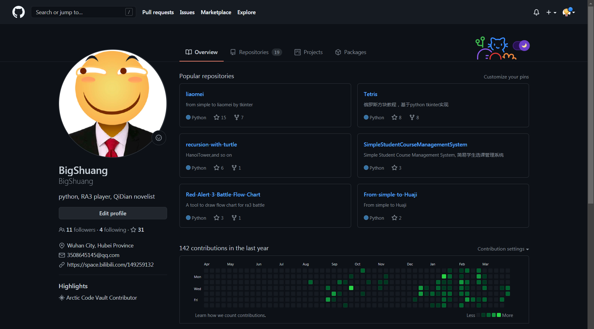

## 标题：我在b站直播编程

## 封面：
直播编程书教程
简单问题免费答

我是大爽，我为自己代言

## 正文
大家好，我是大爽，是python辅导老师

本人直接一对一辅导
没有中间商赚差价
学生少花钱，享受更高质量课程

之前在b站投稿过一些编程项目、编程教程的稿件
这些搞件对应的代码基本都上传到我的github了
其中部分还编写了对应的文本教程，发布到了我的博客（博客园、csdn）

自认为是一个认真、真诚的编程创作者。

同时我还是一个bilibili主播，
时常在b站直播编程(python)和游戏(ra3)

本期视频我想介绍一下我的编程直播，
同时也宣传一下自己的编程直播。

游戏操作太菜，就不多介绍了Orz

后面内容分为4块
- 1 直播心路历程
- 2 直播间亮点介绍：简单问题免费答
- 3 直播特色：我有特殊的直播模式
- 4 其他

## 一 - 直播心路历程
其实我在b站已经直播编程很久了。

从去年2月到今天，我已经直播了一百八十多天
(编程和游戏直播的总天数)

我去年3月到今年4月的每月直播天数

本图由之前的直播年报项目代码生成。
该天数实际为弹幕姬启动天数（大概可以代表个人直播天数）

这只是有(弹幕姬)数据可考证的时间。

我直播编程最早应该可以追溯到19年的秋天

那时候我还在上海打工。
住的是一个特别小的地方，没有网线提供稳定的网络，不方便置办台式电脑直播。
所以只好去网吧直播，抽周内晚上和周末的时候直播。

网吧没有单人包间，只有3-4人的小包间，就这么个小包间还贼贵，一小时15-20左右吧
所以我只能去普通区（就是那种一排五六个电脑的那种公共区域）直播，
普通区好像是一小时8块(我办了卡，有8.8折优惠)。
普通区环境噪声很大，所以当时不开麦，有弹幕的话只能打字回复，有时候回复的慢了结果人都走了。

在那样一种环境下，让我去直播的原因是什么。
- 1是，自己一个人，刚开始去大城市漂泊，没有认识的朋友，感觉格外的孤单，所以希望与人交流。
- 2是，自己希望去分享自己的创作，希望被人看到、被人欣赏。

时至今日，我仍然希望分享自己的创作，渴望与人交流。

## 二 直播间亮点介绍：简单问题免费答

但是一直以来，我直播间互动都挺少，
感觉大部分时候都是单机直播。

对于这个问题，我的解决策略是简单问题免费答。

**直播间弹幕提出的简单问题，在条件允许的情况下，我会免费解答。**

简单的判断标准是：两三分钟内能够解答明白的问题。
条件允许的判断标准为：
- 0 我在（一般我直播一小时会休息十几分钟，休息时会弹幕打字说明，这段时间人可能不在电脑前）
- 1 我会
- 2 直播间内提的问题我有时间来解答(太多问题的话，自然回答不过来)
- 3 考虑到如果问题太多，都回答可能太过耗费时间精力，影响我直播时本来打算要做的事情（具体见三）
  所以我给每天免费回答问题的数量设置一个上限， 个人认为20算是个合理的值

对于耗时远超三分钟的问题，大多数时候，我只会有偿回答
（打算付费前请先私信我，确定我会不会）

这里详细说下，
越具体的问题越好回答，比如某样一行代码发生了某种报错。

而宽泛的问题并不容易回答，
比如如何学好编程，学什么语言好，学了之后能做什么？
个人认为这些问题，并不是在直播间几分钟能够详细说明白。
对于这些方向性的问题，未来我会出新的视频系列《编程之思》挑选一些进行思考。

同时也要说下问答礼仪。
虽然是免费的回答，但是如果我的回答解决了问题的话，
提问者能够投喂一些免费的辣条或者小心心，实在不行，发个弹幕说点好听的话都可以呀Orz

## 三 直播特色：我有特殊的直播模式
介绍完直播间的亮点，
再介绍下我直播间的特色：直播模式。
