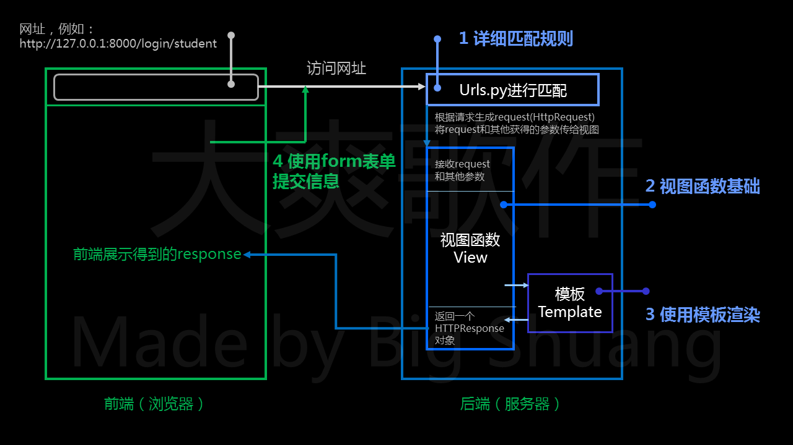

## Django一对一入门辅导

### 授课历史
截至目前(2021/6/28)，
该课程内容已授课两次(即有两位同学购买过)。

教案已完成，一般来讲，授课次数越多，教案越精美，准备越完善。

> 授课次数更新情况可在对应github上查看：
> [Django一对一入门辅导](4.md)

### 简介
预计: 3-4.5小时，掌握Django基础流程和相关逻辑，具备开发基础项目的能力
大概价格: 450-600
授课内容分7部分: url, view, template, form, model, modelform, class-based views

- 第1节课讲前四个(url, view, template, form)
  对应大纲如下

- 第2-3节课讲后三个(model, modelform, class-based views)
  此部分有手绘的大纲，手绘的有点丑Orz。
  (有人购课后会使用ppt重绘大纲，如上面)
  购课后可提醒我制作这部分大纲

### 收费详情：
课程基础时长：三小时
收费: 每小时，1.5倍基础价,
    总价 = 基础价*4.5

注意: 收费按总价收费，包讲三个小时，
学生理解快或其他原因提前结束仍按三小时收费。

超过三小时后，超过时间按照每小时，一倍基础价收费。

**示例说明：**
假设当前基础价为一小时100(实际基础价请以群公告为准)

那么基础总价为450，
超过3小时候，按照一小时100收费。

如果总共授课四个半小时
那么最终总价为450 + 100 * 1.5 = 600元。

### 其他说明
- 如有需要，可进一步定制课程内容，详情请私聊。

- 基础价解释:

由于本人是做一对一辅导，目前价格非常优惠，
未来必然会价格上涨(会循序渐进)。
一般来讲，涨价就涨基础价，
收费系数不变，方便大家理解和计算。
